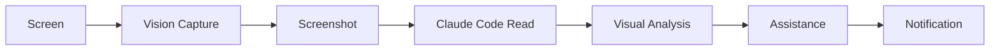

# 🎨 Iris Vision System

**讓 Iris 看懂你的螢幕，主動提供幫助**

Iris Vision System 是一個革命性的視覺理解系統，讓 AI 助手能夠：
- 📸 自動截圖並分析你的螢幕
- 👀 理解你正在做什麼
- 💡 檢測錯誤和問題
- 🤝 主動提供幫助和建議
- 🔄 學習你的工作模式

## 🚀 快速開始

```bash
# 1. 截圖
node vision-capture.js fullscreen

# 2. 分析
node vision-analyzer.js analyze

# 3. 啟動主動助手
node vision-assistant.js start
```

## 📦 系統組件

### 1. Vision Capture (vision-capture.js)
螢幕截圖採集模組

**功能**:
- ✅ 全螢幕截圖
- ✅ 活動視窗截圖
- ✅ 區域截圖
- ✅ 互動式截圖
- ✅ 自動清理舊截圖

**使用**:
```bash
# 全螢幕截圖
node vision-capture.js fullscreen

# 活動視窗
node vision-capture.js window

# 互動式選擇
node vision-capture.js interactive

# 列出所有截圖
node vision-capture.js list

# 清理舊截圖
node vision-capture.js cleanup

# 顯示統計
node vision-capture.js stats
```

### 2. Vision Analyzer (vision-analyzer.js)
視覺分析引擎

**功能**:
- 🔍 場景識別（應用程式、活動）
- 🚨 錯誤檢測
- 💡 建議生成
- 📊 工作流程分析

**使用**:
```bash
# 分析當前螢幕
node vision-analyzer.js analyze

# 啟動監控模式
node vision-analyzer.js monitor 30000

# 單次分析
node vision-analyzer.js once

# 顯示統計
node vision-analyzer.js stats
```

**分析模式**:
- `assistant` - 一般助手模式（預設）
- `debug` - 除錯模式，專注於錯誤
- `automation` - 自動化模式，尋找重複任務
- `security` - 安全模式，檢查敏感資訊

### 3. Vision Assistant (vision-assistant.js)
主動幫助系統

**功能**:
- 🤖 自動監控螢幕
- 🔔 主動通知
- 💬 上下文記憶
- 🎯 智能建議

**使用**:
```bash
# 啟動助手（預設 60 秒間隔）
node vision-assistant.js start

# 自訂間隔和模式
node vision-assistant.js start 30000 debug

# 停用通知
node vision-assistant.js start 60000 assistant --no-notifications

# 查看狀態
node vision-assistant.js status
```

## 🔧 與 Claude Code 整合

這個系統設計為與 Claude Code 的原生視覺能力整合：

1. **截圖模組** 自動截取螢幕
2. **Claude Code** 使用 Read tool 讀取截圖
3. **視覺分析** Claude 原生視覺理解
4. **助手系統** 根據分析提供幫助

### 工作流程



## 📁 檔案結構

```
iris-vision-system/
├── vision-capture.js       # 截圖模組
├── vision-analyzer.js      # 分析引擎
├── vision-assistant.js     # 主動助手
├── config/
│   └── vision-config.json  # 配置文件
└── README.md

~/.iris-vision/
├── captures/               # 截圖存放
├── analysis/               # 分析結果
└── assistance/             # 助手記錄
```

## 🎯 使用場景

### 1. 除錯助手
```bash
# 啟動除錯模式
node vision-assistant.js start 30000 debug
```
當檢測到錯誤訊息時，Iris 會：
- 📸 自動截圖
- 🔍 分析錯誤
- 💡 提供解決方案
- 🔔 發送通知

### 2. 自動化建議
```bash
# 啟動自動化模式
node vision-assistant.js start 60000 automation
```
當檢測到重複操作時，Iris 會：
- 📊 分析工作模式
- 🤖 建議自動化方案
- ⚡ 提供腳本範本

### 3. 工作流程監控
```bash
# 啟動監控
node vision-analyzer.js monitor 60000
```
持續監控並記錄：
- 📈 應用程式使用時間
- 🔄 任務切換頻率
- ⚠️ 錯誤發生次數

## 🔐 隱私與安全

- ✅ 所有截圖存儲在本地（`~/.iris-vision/`）
- ✅ 自動清理舊檔案（預設 24 小時）
- ✅ 不上傳任何資料
- ✅ 可隨時停用

## 📊 統計資訊

```bash
# 查看截圖統計
node vision-capture.js stats

# 查看分析統計
node vision-analyzer.js stats

# 查看助手狀態
node vision-assistant.js status
```

## 🛠️ 進階配置

創建 `~/.iris-vision/config.json`:

```json
{
  "capture": {
    "captureDir": "~/.iris-vision/captures",
    "maxAge": 86400000,
    "maxFiles": 100
  },
  "analyzer": {
    "contextWindow": 5,
    "mode": "assistant"
  },
  "assistant": {
    "monitoringInterval": 60000,
    "notificationEnabled": true,
    "autoAnalyze": true,
    "minChangeThreshold": 0.1
  }
}
```

## 🚧 開發中功能

- [ ] 瀏覽器特定分析（via BrowserOS MCP）
- [ ] 視覺記憶長期存儲
- [ ] 工作流程自動錄製
- [ ] OCR 文字提取
- [ ] 視覺元素點擊（描述式導航）
- [ ] 多螢幕支援

## 📝 版本歷史

- **v1.0.0** (2025-11-01) - Initial release
  - Vision Capture module
  - Vision Analyzer engine
  - Vision Assistant system

## 🤝 整合到 Iris System

此模組將整合到 Iris System v2.1.0:

```bash
# 從 iris-system 呼叫
claude mcp add iris-vision

# 或作為 LaunchAgent 運行
launchctl load ~/Library/LaunchAgents/com.lman.iris-vision.plist
```

## 📄 授權

MIT License

---

🤖 **Generated with [Claude Code](https://claude.com/claude-code)**
**via [Happy](https://happy.engineering)**

**Co-Authored-By: Claude <noreply@anthropic.com>**
**Co-Authored-By: Happy <yesreply@happy.engineering>**
